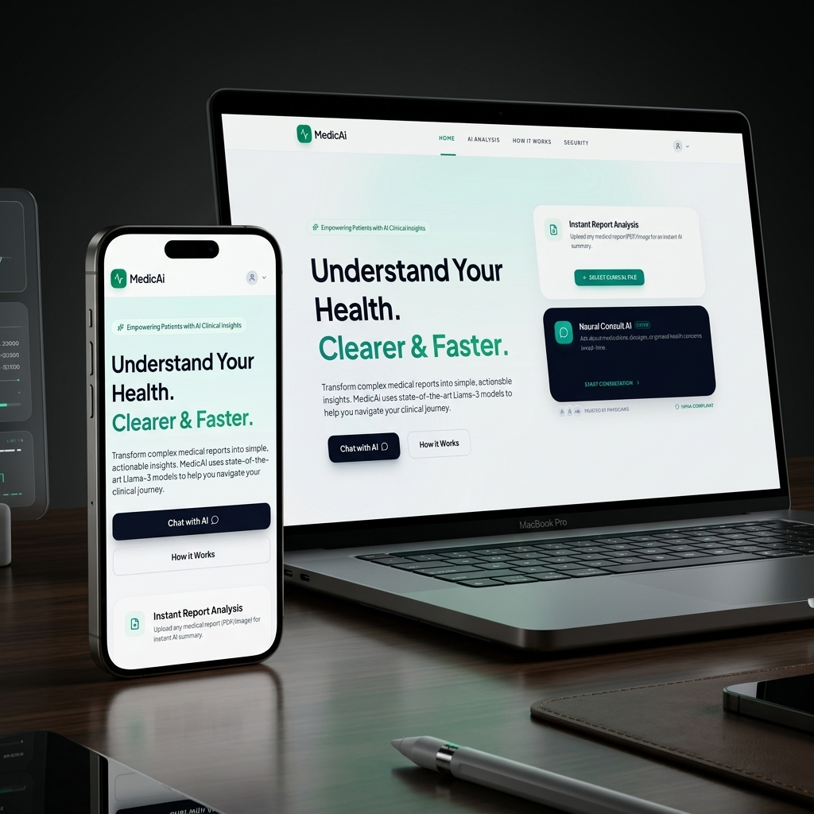

# 🏥 MedicAi: The Advanced Clinical Intelligence Ecosystem

[](https://medic-ai-helper.vercel.app/)
[](LICENSE)
[](https://vercel.com)

<div align="center">
  <h3>🚀 <a href="https://medic-ai-helper.vercel.app/">Click here for live demo</a></h3>
  
  <p><i>A premium, high-fidelity clinical intelligence ecosystem spanning desktop and mobile platforms.</i></p>
</div>

**MedicAi** is a state-of-the-art, privacy-centric health platform designed to transform raw clinical data into actionable insights. Built with a focus on professional aesthetics and neural-processed accuracy, it bridges the gap between complex medical reports and patient understanding.

---

## ✨ Key Features

### 🔍 Instant Report Analysis
Upload any medical report (PDF/Image) to trigger our **Neural Parsing Engine**. MedicAi extracts structural lab results and synthesizes them using **Llama-3**, providing a clear, jargon-free summary in seconds.

### 🧠 Neural Consult AI
A 24/7 clinical chat assistant powered by **RAG (Retrieval-Augmented Generation)**. Ask about medications, dosages, or general health concerns with verified medical context and high accuracy.

### 📊 Health Governance Dashboard
A centralized hub to track your clinical history, recent analyses, and overall health stats. Designed with a clinical-grade "Slate & Teal" aesthetic for maximum readability.

### 🛡️ Privacy-First Security
- **Encrypted Communication**: All clinical inquiries are transmitted via secure, encrypted channels.
- **Account Governance**: Robust security portal with password management and device tracking.
- **Data Privacy**: Export or clear your clinical analysis cache at any time.

---

## 🛠️ The Tech Stack

### Frontend (Clinical UI)
- **Vite + React**: For blazing-fast performance and component architecture.
- **Framer Motion**: Powering premium micro-animations and sliding navigation.
- **Lucide Icons**: High-fidelity medical and system iconography.
- **Tailwind CSS**: Custom clinical design system.

### Backend (Intelligence Engine)
- **Node.js & Express**: Scalable API architecture.
- **MongoDB Atlas**: Secure, cloud-hosted patient record storage.
- **Groq AI (Llama-3)**: The neural engine behind the analysis and chat.
- **Multer/PDF-Parse**: High-accuracy document digitization.

---

## 📦 Local Installation

### Prerequisites
- Node.js (v18+)
- MongoDB Atlas Connection
- Groq API Key

### 1. Clone the Repository
```bash
git clone https://github.com/risshhubh/MedicAi.git
cd MedicAi
```

### 2. Configure Backend
```bash
cd backend
npm install
# Create a .env file with:
# MONGO_URI=your_mongodb_uri
# GROQ_API_KEY=your_groq_key
# JWT_SECRET=your_secret
# GOOGLE_CLIENT_ID=your_google_id
```

### 3. Configure Frontend
```bash
cd ../frontend
npm install
# Create a .env file with:
# VITE_GOOGLE_CLIENT_ID=your_google_id
```

### 4. Run Development Servers
```bash
# In backend folder
npm run dev

# In frontend folder
npm run dev
```

---

## 🔒 Security Statement
MedicAi is built with security as its core pillar. While current deployments are for demonstration purposes, the architecture is designed to be **HIPAA-Ready**, utilizing end-to-end encryption and metadata stripping during clinical parsing.

---

## 🤝 Contribution
Potential partners (Hospitals/Clinics) looking for API access or custom integrations can contact our clinical concierge via the **[Contact Us](https://medic-ai-helper.vercel.app/contact)** portal.

---
*Created with ❤️ for a Healthier Future.*
